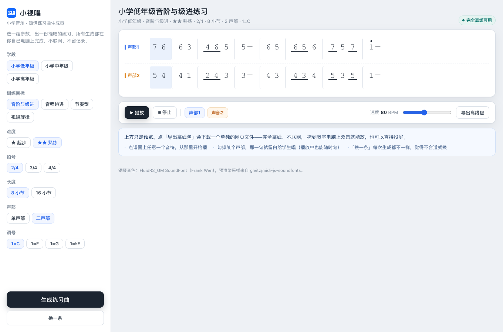
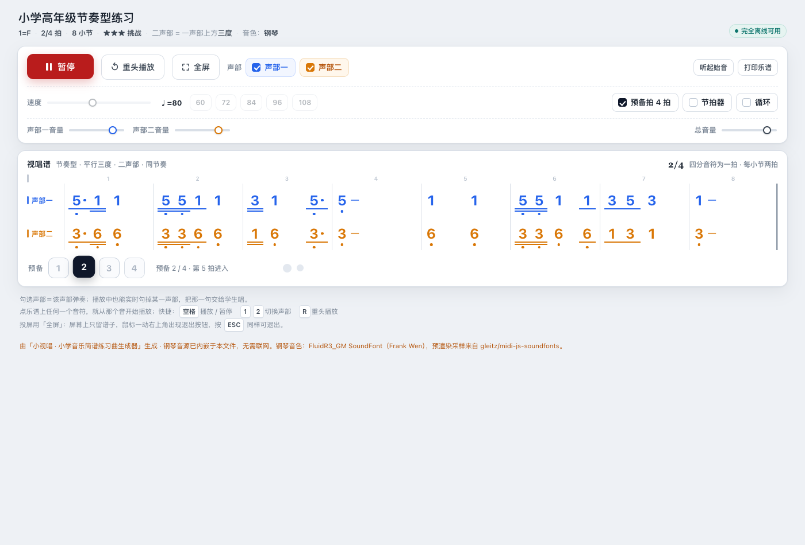

# 🎵 小视唱 · 小学音乐简谱练习曲生成器

选几个参数，出来一条能唱的简谱练习曲。小学音乐老师备课时用。

**[▶ 在线直接用](https://xiaoshichang.donqui.me)** ｜ **[⬇ 下载生成页](简谱练习曲生成器.html)**（约 800 KB，一个文件，双击即开，断网也能生成和播放）



## 🎯 这是什么

场景很具体：这节课要练音阶，下节课要练四度跳进，手头现成的谱子要么太难要么太幼稚，自己编又费时间。

选一下学段、训练目标、难度、拍号、长度、声部和调号，出来一条 8 小节或 16 小节的简谱练习曲。点开听一遍，不合适就「换一条」，每条都不一样；觉得行，就导出带走。

带走的不是链接，**是一个网页文件** 📄。拷到教室电脑上双击就能放，断网也行，投屏也行。

上面那张图是生成页——它只是预览。真正上课用的是导出出来的那个文件，长这样：



## 📖 怎么用

### 一、什么也不用装

打开 <https://xiaoshichang.donqui.me>，选参数，点「生成练习曲」，再点「播放」听。

就这样。不注册、不登录、不留记录 🙅

### 二、带去教室：下载一个文件

1. 生成页上选好参数，点「生成练习曲」
2. 点「导出离线包」，浏览器会下载一个 `.html` 文件
3. 把这个文件拷到教室电脑上（U 盘、微信传给自己、企业微信都行）
4. **双击打开** —— 就这一步

那个文件是完全自包含的：钢琴音色、乐谱、播放器全在里面，**不会发出任何一个网络请求** 📴。断网、机房老电脑、一体机都能放；不需要联网激活，不需要装插件，也不会过期。

想先在电脑上试试，也可以直接下载仓库里的 [简谱练习曲生成器.html](简谱练习曲生成器.html) 双击打开——那是生成页本身，离线也能生成和播放。

### 三、谱面上能做的三件事

- 👆 **点任意一个音符，从那里开始播。** 讲哪一句就点哪一句，不用从头放。
- 🔇 **勾掉某个声部，那一句就留白给学生唱。** 播放中也能随时勾，用来做「老师唱一声部、学生唱二声部」。低声部写得比高声部简单——教学上本来就是先教低声部。
- 🔄 **「换一条」每次都不一样。** 同一个参数组合可以一直换，换到满意为止。

导出页上还有全屏、预备拍、节拍器、循环、分声部音量，以及打印乐谱 🖨

## ⚙️ 参数

| 参数   | 可选                                    | 说明                    |
| ---- | ------------------------------------- | --------------------- |
| 学段   | 小学低年级 / 中年级 / 高年级                     | 决定音域                  |
| 训练目标 | 音阶与级进 / 音程跳进 / 节奏型 / 视唱旋律             | 只描述单个声部内的旋律特征         |
| 难度   | ★ 起步（听两遍能跟）/ ★★ 熟练（看谱能唱）/ ★★★ 挑战（要慢练） | 用学生听得懂的行为描述，不用「初/中/高」 |
| 拍号   | 2/4、3/4、4/4                           |                       |
| 长度   | 8 小节 / 16 小节                          | 正好一行谱 / 两行谱，一眼看完      |
| 声部   | 单声部 / 二声部                             | 二声部＝高声部＋低声部           |
| 调号   | 1=C、1=F、1=G、1=♭E                      |                       |

💡 **声部按音高命名，不按性别。** 这是「高声部／低声部」而不是「女高／男低」的原因：变声之前的男女童音色接近、音域也差不多，硬套成人合唱那套 SATB 是套错了对象。

💡 **速度不是生成参数。** 它是播放时才调的（40–132 BPM，默认 80），生成的时候只把默认速度写进谱面。

## ❓ 常见问题

**断网能用吗？**  
能。导出的文件里没有任何外部请求——连音色都是内嵌的。这条在构建时是硬断言，产物里出现一个 `http://` 就直接构建失败（唯一的例外是署名许可必须给出的许可链接，那两行只是注释里的纯文本）。

**要注册吗？有人记录我用了什么吗？**  
不要账号，不做统计，不落任何日志。生成和播放全在你自己的浏览器里跑完。

**为什么不能上传教材上的谱子？**  
那属于识谱，本版不做。顺带说清另一件事：因为是完全生成的，所以不存在版权问题；代价是它不覆盖教材原谱，只能出练习。

**为什么没有三声部？**  
二声部的做法是「先写高声部，低声部按音级严格平行三度派生」。三个声部照这个叠会让外声部之间出现连续平行五度，那是对位法上的硬错误——这一条不能像「童声放宽连续三度」那样放宽，得另写一套三部和声的逻辑。所以本版不支持。

**生成的曲子会不会重复？**  
不会精确重复。同一个参数组合，每次生成都换乐句骨架、换起音、换节奏变奏。当然风格是稳定的（本来就该像练习曲），所以「听着像同一类」是对的，「跟第三条一模一样」不会发生。

**能改吗？能商用吗？**  
代码可以，见下面的授权。标志（logo）不行，单独说明在 [THIRD-PARTY.md](THIRD-PARTY.md)。

## 📦 仓库里有什么

```
README.md                     这份说明
LICENSE                       MIT
THIRD-PARTY.md                钢琴采样与标志的版权说明（重要）
简谱练习曲生成器.html            ← 交给老师的那个文件，下载即用
样张集.html                    各种参数组合的样张，可以直接试听对比

assets/                        README 用的图
logo/                          标志（源文件 + 导出资产）

engine.py / engine.js          生成引擎。两份实现，逻辑一一对应
rules.py                       所有可调数值集中在这里（音域、难度、音程白名单……）
views.py                       页面模板与前端代码（记谱、播放器、导出包拼装）
piano.py                       钢琴采样表与署名字符串的唯一出处
rng_util.py                    随机数发生器
build_site.py                  构建「简谱练习曲生成器.html」
build_samples.py               构建「样张集.html」
fetch_samples.py               抓取并核验钢琴采样
offline_template.src.html      导出包模板（build_site 的输入）
license-urls.json              构建断言放行的许可链接白名单
samples/                       20 个钢琴采样 + manifest.json
```

### 🔧 想自己重新生成

```bash
python3 build_site.py       # 重建 简谱练习曲生成器.html
python3 build_samples.py    # 重建 样张集.html
```

只要 Python 3，没有第三方依赖。产物是**可复现的**——源码和采样不变，重建出来跟仓库里那份逐字节相同。

（`samples/` 里的采样已经随仓库分发，不用联网抓。`fetch_samples.py` 是当初抓取和核验用的，`--check` 模式可以离线核对文件完整性和 md5。）

## 📄 授权与致谢

代码以 **MIT** 协议发布，见 [LICENSE](LICENSE)。用、改、再分发、商用都可以，不用事先打招呼。

钢琴音色来自 Frank Wen 的 **FluidR3_GM SoundFont**（经 gleitz/midi-js-soundfonts 在 jsDelivr 上托管），署名与许可见 [THIRD-PARTY.md](THIRD-PARTY.md)。两个 HTML 产物的页脚和文件头注释里也各带一份——音频副本走到哪，声明就跟到哪。

标志（logo）是委托设计的作品，**不在 MIT 授权范围内**，请不要单独提取使用，同样见 [THIRD-PARTY.md](THIRD-PARTY.md)。

✉️ 发现曲子不对、参数不合理、或者有别的想法，发邮件到 **<mmsensi@gmail.com>**。教音乐的老师和音乐专业的朋友尤其欢迎挑刺——规则表里那些数值（乐句长度、换气点、跳进后的回落、音程白名单）都是可以调的，只是需要有人告诉我哪里不像歌。
